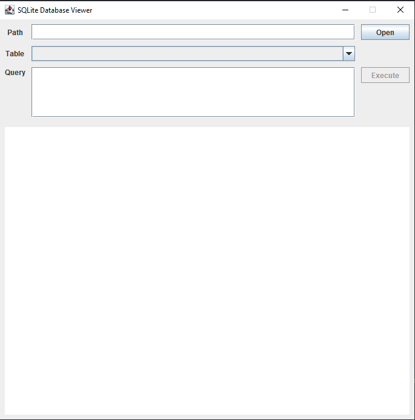
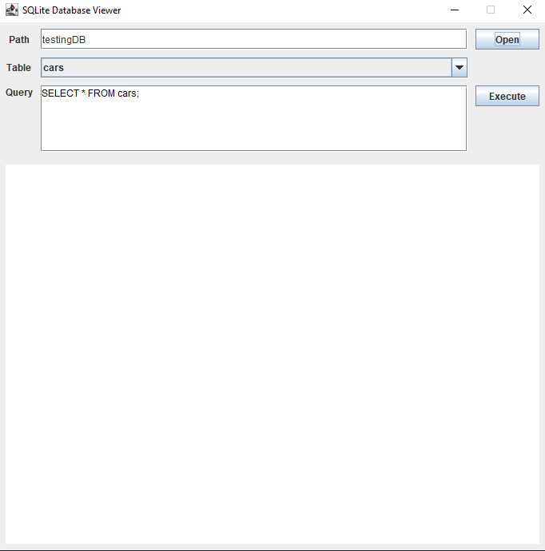
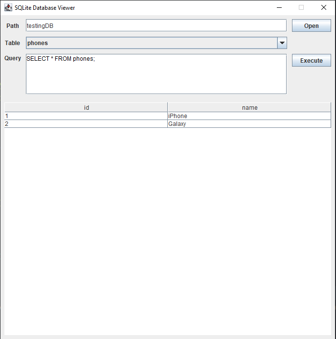
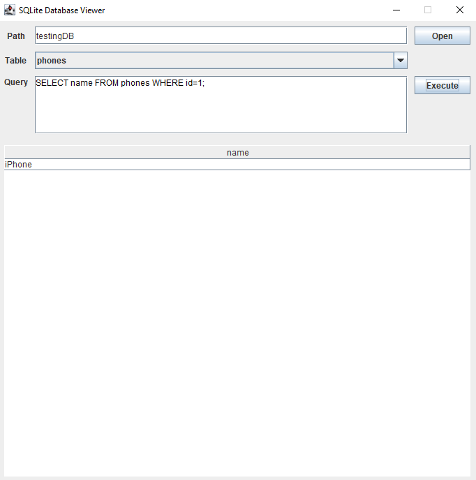

# SQLite Database Viewer
Sometimes we need a tool that shows the database contents, tables and the data inside.
SQLite Database Viewer is a JAVA SWING GUI Application that connects to SQLite database and let the user extract data using SQL queries.

